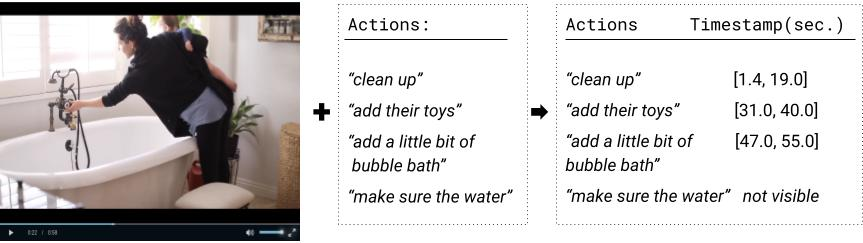
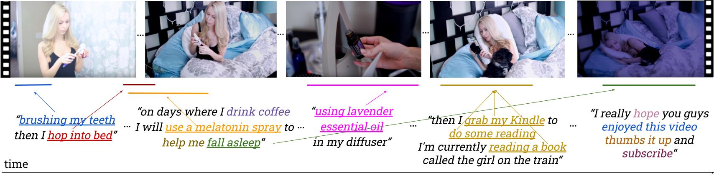

# Temporal Localization of Narrated Actions in Vlogs

This repository contains the dataset and code for our todo_conf paper:
[When did it happen? Duration-informed Temporal Localization of Narrated
Actions in Vlogs](todo_arxiv)

## Task Description

<p align="center"> Given a video and its transcript, temporally localize the human actions mentioned in the video. </p>

## Dataset 

<p align="center">Distinguishing between actions that are narrated by the vlogger but not visible in the video
and actions that are both narrated and visible in the video (underlined), with a highlight on visible actions that represent the same
activity (same color). The arrows represent the temporal alignment between when the visible action is narrated as well as the time it
occurs in the video.</p>

### Annotation Process
1. The extraction of actions from the transcripts and their annotation of *visible/ not visible* in the video 
is described in detail in this [action detection project](https://github.com/OanaIgnat/vlog_action_recognition).
2. The visible actions are temporally annotated using this [open source tool](https://github.com/OanaIgnat/video_annotations) that we built.

Video-clips | Video hours | Transcript words | Visible actions | Non-visible actions |
------------ | ------------- | ------------- | ------------- | ------------- | 
1,246 | 20 | 302,316 | 3,131 | 10,249|

The data is stored [here](https://drive.google.com/drive/folders/1c44X6HJkQU45mK7XFXIULXZ9gZeWTQ30?usp=sharing) (video urls, action embeddings, I3D features & others).

## Data format
The temporal annotations of the visible actions are available at [`data/dict_all_annotations_ordered.json`](data_old/dict_all_annotations_ordered.json).
The visibility annotations of the actions are available at [`data/miniclip_actions.json`](data_old/miniclip_actions.json) and you can read more about 
the process in the [action detection project](https://github.com/OanaIgnat/vlog_action_recognition).

The visible actions are assigned a start and end time at which they are localized in the miniclip. This does not necessarily
correspond to the time the actions are mentioned in the miniclip. The time the actions are mentioned in the miniclip is extracted
from the transcript, is the input for the Transcript Alignment method and is found at [`data/mapped_actions_time_label.json`](data/mapped_actions_time_label.json) 


The miniclip name is formed by concatenating its YouTube channel, playlist, video and miniclip index. For miniclip "4p1_3mini_5.mp4":
* 10 = __channel__ index
* p0 = __playlist__ index (0 or 1) in the channel
* 10 = __video__ index in the playlist
* mini_2 = __miniclip__ index in the video


Example format in JSON:

```json
{
  "10p0_10mini_2.mp4": [
    ["go to first start by and shred up your kale", 26.0, 32.0],
    ["place this into a large bowl", 27.0, 31.0],
    ["break down the cell walls of the kale", 41.0, 51.0],
    ["give it a good massage with your hands", 41.0, 50.0],
    ["add in your butter lettuce", 52.0, 55.0]
  ]
}
```
* key is miniclip
* [action name, time start, time end]

## Experiments

1. Check [`args.py`](args.py) to set the arguments
2. Run [`main.py`](main.py)] to run the entire pipeline: data creation, MPU model training, MPU model evaluation and 2SEAL model evaluation
   1. 2SEAL evaluation also contains action duration classification SVM method


## Citation information
If you use this dataset or any ideas based on the associated research article, please cite the following:

```bibtex
@article{10.1145/3495211,
year = {2021},
issue_date = {January 2021},
publisher = {Association for Computing Machinery},
volume = {1},
number = {1},
issn = {1551-6857},
journal = {ACM Trans. Multimedia Comput. Commun. Appl.}
}
```

